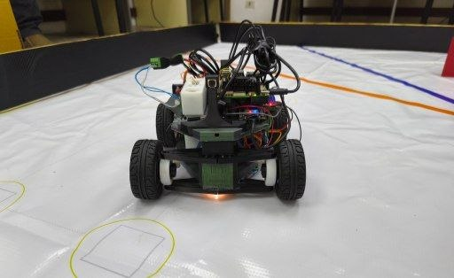
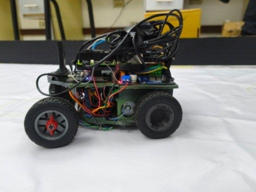
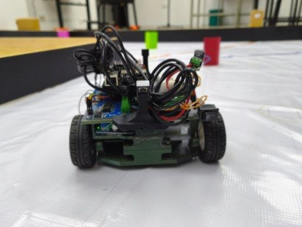
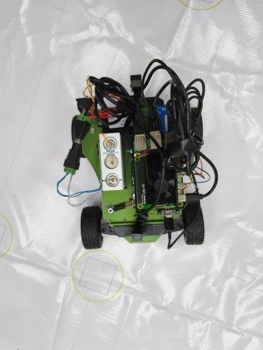
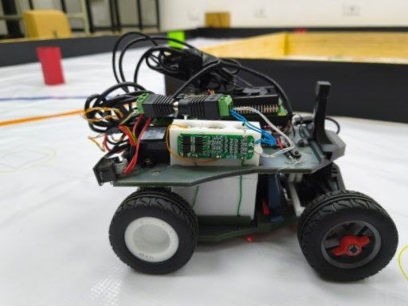

# 3D model

Every structural part of the car is printed. The chassis is not a box with
things screwed onto it: the motor mount, the gear supports, the steering rack
housing, the camera mast and the electronics deck are features of the same
model, which is the only way we got the car down to the size it is now.

```
3d-model/
├── stl/                    parts as printed
├── print-projects/         sliced projects (.3mf) with the settings we actually used
├── Documentación 3D/       one folder per part, grouped by function/subassembly
│   ├── A-Arm/
│   ├── Battery/
│   ├── Camera/
│   ├── Chassis/
│   ├── Diferrential/
│   ├── RaspberryPi5Mount/
│   └── Steering/
├── img/                    photos of the assembled car
└── README.md
```

## The car



*Fig. 1 — Front view. Front axle, steering geometry at ride height, and the
status LED on the electronics deck.*



*Fig. 2 — Side profile. Wheelbase, motor/gearbox housing in the lower
chassis, and the wiring harness routed along the middle deck.*



*Fig. 3 — Rear view. Camera mast rising from the electronics deck, between
the rear wheels and the differential housing.*



*Fig. 4 — Top view. Raspberry Pi 5 and wiring harness on the upper deck,
showing the wheel track and overall footprint.*



*Fig. 5 — Front, ¾ view. Front suspension links and the sensor mounts ahead
of the steering rack.*

## Current design

**WRO CAR XVII** — the seventeenth iteration of the chassis, and the one the car
runs today.

| | |
|---|---|
| Overall size | ≈ 200 mm long × 180 mm wide × 150 mm tall |
| Rules limit | 300 × 200 mm footprint, 300 mm height, 1500 g |
| Wheelbase | ≈ 150 mm |
| Wheel diameter | 65.2 mm |
| Drive | one DC motor → 2:1 gearing → rear axle with a mechanical differential |
| Steering | MG996R on a rack and pinion, Ackermann geometry, ≈26° at full lock |
| Camera | 125 mm above the floor, tilted 7.5° down |
| Material | PLA |
| Weight | 1150 g (limit is 1500 g) |

## Parts

Every printed part lives in its own folder under
[`Documentación 3D/`](Documentación%203D/) — a `.3mf` (the sliced project,
ready to print) plus a reference screenshot. Folders are grouped by
subassembly, i.e. the parts that mount together or share a function:

| Group | Function | Individual parts |
|---|---|---|
| [`A-Arm/`](Documentación%203D/A-Arm/) | Front suspension links | `Lower A-Arm Left`, `Lower A-Arm Right`, `Upper A-Arm (2pcs)` |
| [`Battery/Case/`](Documentación%203D/Battery/Case/) | 3S1P battery enclosure | `Lower Case 3S1P Battery`, `Upper Case 3S1P Battery` |
| [`Battery/Fittings/`](Documentación%203D/Battery/Fittings/) | Cell retention inside the case | `Cylinder (4 parts)`, `Rectangle (4 parts)` |
| [`Camera/`](Documentación%203D/Camera/) | Camera mast and mount — the fixed geometry (125 mm height, 7.5° tilt) the vision pipeline relies on | `CameraMount`, `Camera Support Mount 82.5g`, `LowerCameraMount`, `Pin` |
| [`Chassis/`](Documentación%203D/Chassis/) | Structural core: motor mount, gear supports, steering rack housing, electronics deck | `Lower Chassis`, `Middle Chassis`, `MotorChassis`, `Upper Chassis` |
| [`Diferrential/`](Documentación%203D/Diferrential/) | Mechanical differential and drive gear train, rear axle | `Crown Gear 48D Train Type`, `Differential Case Cover`, `Left Axle Support`, `Right Axle Support`, `MotorGear_TrainType`, `PlanetGear (2pcs)`, `PlanetGearAxle`, `RearGearAndRingLeft`, `RearGearAndRingRight` (`GearRight`, `RearRingRight`, `RingGearCoupling`) |
| [`RaspberryPi5Mount/`](Documentación%203D/RaspberryPi5Mount/) | Raspberry Pi 5 mounting plate | `RaspberryPi5Mount` |
| [`Steering/`](Documentación%203D/Steering/) | Rack-and-pinion steering, Ackermann geometry | `FrontRing (2pcs)`, `FrontWasher`, `Servo Bracket`, `Steering Knuckle Left`, `Steering Knuckle Right`, `SteeringRack`, `SteeringServoGear`, `SteeringStop` |

## Why it got smaller instead of prettier

The first chassis was built to hold the parts. This one is built to fit the
track, and every millimetre we removed bought something specific:

- **The parking bay is 20 cm wide and 1.5 × the car's length.** A longer car
  needs a longer bay and has to hit it more precisely. Shortening the car is the
  cheapest possible improvement to the parking manoeuvre — it happens before any
  code runs.
- **Turning circle.** With a 150 mm wheelbase and ~26° of lock the car turns
  inside roughly 310 mm of radius. That is what lets it take a corner inside the
  narrow (600 mm) track configuration without a three-point turn.
- **The tail sweeps less.** With Ackermann steering the rear wheel cuts inside
  the front one. A shorter, narrower car sweeps a smaller area, and that is
  exactly the area that used to knock over the pillar we had just passed.
- **Weight and the print queue.** Smaller parts print faster and fail less. When
  a part broke two days before a test we could reprint it the same afternoon
  instead of losing the week.
- **Everything the camera needs is fixed by geometry.** Camera height and tilt
  are model dimensions, not adjustments — the software converts pixels to
  millimetres from those two numbers, so a chassis that holds the camera rigidly
  at 125 mm and 7.5° is worth more than any amount of calibration.

## Reprinting it

The `.3mf` projects carry the settings we used: 0.4 mm nozzle, 0.2 mm layers,
PLA. Print the base flat with no supports; the gear supports and the steering
parts want more perimeters than infill — they take load, and infill does not
carry it.

> **TODO (team):** export the parts of **WRO CAR XVII Final** to `stl/` and to
> STEP, and replace the older exports currently in this folder (they are from
> the June–July iterations). The Fusion source file is ~200 MB, well over
> GitHub's 100 MB per-file limit, so it does not belong in the repository: put a
> Fusion shared link here instead, and keep STL + STEP + 3MF as the files people
> can actually use.
