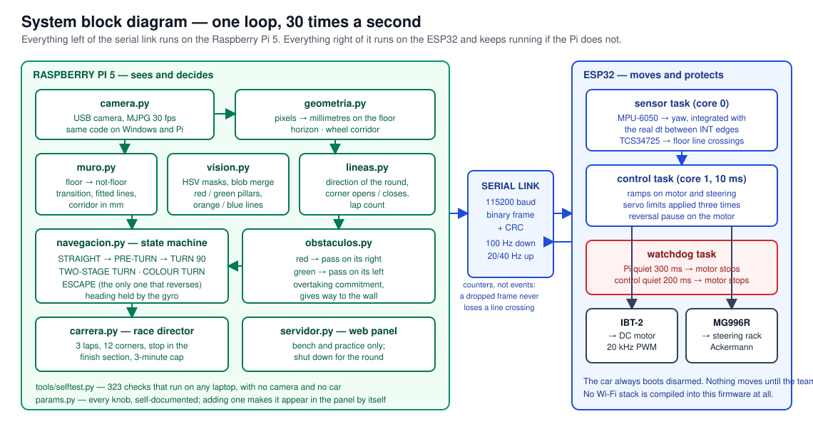

<<<<<<< HEAD
<<<<<<< HEAD
# Future-Engineers---GreenTech-Momboy
=======
# GreenTech Momboy — WRO 2026 Future Engineers

Engineering documentation for our self-driving car: a 200 × 180 × 150 mm
printed chassis, one drive motor through a mechanical differential, Ackermann
steering, and a single USB camera that we turned into a distance sensor.

**Team GreenTech Momboy — Venezuela.** Two students, one coach, seventeen
chassis revisions and about four months of evenings.

| | |
|---|---|
| Category | Future Engineers |
| Season | WRO 2026 |
| Country | Venezuela |
| Vehicle | 200 mm × 180 mm × 150 mm — limit is 300 × 200 mm and 300 mm tall |
| Controllers | Raspberry Pi 5 (8 GB) + ESP32 |
| Perception | 1 USB camera, 1 gyroscope, 1 floor colour sensor |
| Software | Python 3.11 + OpenCV on the Pi, Arduino C++ on the ESP32 |
| Status | Both challenges running; parking manoeuvre in progress |

---

## Contents

- [Repository map](#repository-map)
- [The team](#the-team)
- [The vehicle](#the-vehicle-mobility-management)
- [Power and sensors](#power-and-sensors)
- [Software](#software-architecture)
- [Obstacle strategy](#obstacle-strategy)
- [Why we chose what we chose](#why-we-chose-what-we-chose)
- [Testing and reproducing our work](#testing-and-reproducing-our-work)
- [Rules compliance](#rules-compliance)

## Repository map

| Folder | What is in it |
|---|---|
| [`main/`](main/) | The car we race. Pilot program (Pi) + ESP32 firmware. Both challenges, selected by profile |
| [`fallback/`](fallback/) | The previous system, still runnable: reconizer (Pi) + the same firmware |
| [`schemes/`](schemes/) | Wiring diagram, system block diagram, pinout, power budget |
| [`3d-model/`](3d-model/) | Printed parts (STL) and the sliced projects with the settings we used |
| [`images/`](images/) | Team and vehicle photos, build photos, and the frames the car itself recorded |
| [`journal/`](journal/) | The engineering journal, the test logs, and the previous prototype |
| [`video/`](video/) | Links to the driving videos, one per challenge |

The two code folders are each complete and runnable on their own: `main/` is the
car we race today, `fallback/` is the system that came before it. Keeping both
means we can go back to a known-good program in the pits by changing which
`main.py` we launch, instead of reverse-engineering a git revert under pressure.

There is no separate folder per challenge. It is one program that runs both
rounds, and the round is chosen by which calibration profile is loaded — the
Obstacle Challenge simply switches obstacle handling on. Splitting it into two
copies would have meant fixing every bug twice.

## The team

| | |
|---|---|
| **José Simón García Castellanos** | Obstacle challenge: pillar detection, avoidance geometry, the overtaking commitment |
| **Cristian José Rangel** | Open challenge: wall following, corner detection and counting, the CAD of the chassis |
| **Tutor / Coach** | **Msc. Edgardo Paolini** |

Both of us worked on every prototype, early and late. We split by *challenge*
rather than by layer on purpose: each of us owns a full vertical slice — camera
to wheels — for one round, which means either of us can debug an entire round
end to end without waiting for the other. The branches are shared, the debug
panel shows the same telemetry to both, and the merges are where we review each
other's work.

Our coach did not build or program the car — the rules are explicit about that,
and so are we. What our coach did was make sure a track existed to practise on,
ask "how do you know?" every single time we claimed something worked, and make
us stop and write things down at the exact moments we would rather have kept
hacking. Most of the failure analysis in this repository exists because somebody
kept asking that question.

## The vehicle (mobility management)

| | |
|---|---|
| Size | ≈ 200 mm long, 180 mm wide, 150 mm tall |
| Wheelbase | ≈ 150 mm |
| Wheels | Ø 65.2 mm |
| Drive | 1 DC motor, 500 rpm, 2:1 gearing, rear axle with a mechanical differential |
| Steering | Servo MG996R on a rack and pinion, Ackermann geometry, ≈26° at full lock |
| Top speed | ≈ 850 mm/s at full PWM; we cruise at about a fifth of that |
| Turning radius | ≈ 310 mm |
| Chassis | Printed PLA, seventeen revisions |
| Weight | 1150 g — limit is 1500 g |

### Speed and torque

The first motor we looked at ran at 1000 rpm. On a 3 × 3 m track with corners
every 3 metres, that is not fast, it is unusable: at that speed the car crosses
a floor line between two samples of the colour sensor, and the control loop
spends every corner recovering instead of driving. We went to a 500 rpm motor
with 2:1 gearing to the axle, which puts about 850 mm/s at the wheel with the
PWM at maximum — and in practice we run cruise at 55 out of 255, roughly
180 mm/s, because on this track reliability scores more points than speed.

Gearing down also gives us the torque to start smoothly from a stop, which
matters at the very beginning of the round: the parking bay start leaves no room
for a wheel-spinning launch.

### One motor, one steering actuator

The rules require exactly this, and they disqualify a differential-wheeled base.
So: one motor drives both rear wheels through a **mechanical differential**, and
one servo steers the front wheels through a rack and pinion with Ackermann
geometry. Nothing about direction is done by driving one side faster than the
other.

Ackermann steering shapes the software more than anything else on the car: the
rear wheel cuts inside the front one, so the car cannot return to the middle of
the lane the instant it has passed a pillar. That single geometric fact is where
the "overtaking commitment" in the obstacle code comes from.

### Why the chassis got smaller

We designed the first chassis around the components, and it was too long. The
compact chassis (revision XVII) came out of a list of things that were costing
us points on the track, and every item on that list was geometry:

- **The parking bay is 20 cm wide and 1.5 × the length of the robot.** A shorter
  car needs a shorter bay and can place itself less precisely. That is the
  cheapest improvement to the parking manoeuvre available, and it happens before
  any code runs.
- **The narrow track configuration is 600 mm wide.** With a 150 mm wheelbase and
  ~26° of lock we turn inside ~310 mm of radius, which fits.
- **The tail used to knock over the pillar we had just passed.** A shorter,
  narrower car sweeps a smaller area on the way out of an avoidance.
- **The camera stopped moving.** Every distance the software computes comes from
  two numbers, camera height (125 mm) and tilt (7.5°). On the old chassis the
  mast flexed, so those numbers were not constant, so no calibration held. On
  this one the mast is part of the structure.
- **Smaller parts print faster and fail less**, which decides how quickly you
  recover when something snaps two days before a test.

The full story, with dates, is in [`journal/engineering-journal.md`](journal/engineering-journal.md).

## Power and sensors



Full detail: [`schemes/`](schemes/) — [pinout](schemes/pinout.md),
[power budget](schemes/power-budget.md),
[wiring diagram](schemes/wiring-diagram.svg).

### Bill of materials

| Part | What it does | Where it connects |
|---|---|---|
| Raspberry Pi 5, 8 GB | Vision and decisions | USB camera, USB to the ESP32 |
| ESP32 | Hardware control and failsafe | Pi over USB serial (or GPIO 16/17) |
| Camera WN-L1812.K56R (IMX179) | The only sensor that sees the track | USB 2.0, MJPG, 30 fps |
| MPU-6050 | Yaw: heading on straights, closing the 90° turns | I2C 0x68 + INT on GPIO 18 |
| TCS34725 | Floor colour: the orange and blue corner lines | I2C 0x29 + INT on GPIO 19 |
| IBT-2 (BTS7960) | H-bridge for the drive motor | GPIO 25/26/27/33, PWM 20 kHz |
| Servo MG996R | Steering | GPIO 32, 50 Hz, 500–2400 µs |
| DC motor 500 rpm | Drive | Through 2:1 gearing to the rear axle |
| Battery pack | **TODO (team): chemistry, cells, capacity** | Main switch → H-bridge and regulator |

### Three sensors, and why not more

**The camera is the distance sensor.** With the lens at a known height and a
known tilt, every pixel on the floor maps to a millimetre distance. That gives
us a distance profile across the whole width of the image — a poor man's lidar —
instead of a single point. All the thresholds in the code (`turn below X mm`,
`stop below Y mm`) are physical distances, which is why the same calibration
works on the 1000 mm track and on the 600 mm one.

**We tried distance sensors and dropped them.** A single-point sensor cannot
tell a wall from a pillar, and it adds a rail, a cable and a failure mode for
information the camera already produces across the whole frame.

**The gyroscope earns its place** because an angle measured *from the car* is
useless for telling one wall from another — it changes with how crooked the car
is. The angle relative to the *track* is what matters, and converting between
the two needs exactly one number: how far the car has drifted from the heading
of the straight. That is the gyro. With it, one wall is enough to know whether
it is the wall of your lane or the far wall of the corner, even with the car
crossed at 45°.

**The colour sensor earns its place** because it is the only physical fact the
car gets. Everything else is inference from an image; the orange or blue line
passing under the car *happened*.

### Handling sensors that are not there

Both INT lines are optional: if they are not wired, the firmware detects it and
falls back to polling. On a competition weekend a broken jumper should cost
precision, not the round. The panel shows, sensor by sensor, what was detected.

That behaviour came from a real failure: the ESP32 used to probe the I2C bus
immediately after `Wire.begin()`, before the sensors woke up and while the motor
start-up pulled the rail down, and then declared both absent for the rest of the
run. Wait 250 ms, retry every 3 s, and give the humans a manual retry button.

### The start button, and stopping without the panel

The rules want the round to begin with a single action on a robot already
sitting on the track: no keyboard, no screen, no cable, nothing wireless. So
there is **one push button** on GPIO 13 — two wires and the internal pull-up,
no resistor — and it works like the start/stop of a stopwatch:

| Press it | With the car | What happens |
|---|---|---|
| once | stopped | arms and starts the round |
| again | running | disarms and stops |

Two details we argued about and are glad we got right:

- **It travels as a level, not as a counter.** A floor line is crossed in 40 ms
  and has to be latched and counted or it is lost; a finger holds a button for
  100–300 ms, which is four to twelve sensor frames. And a counter would store
  presses: a serial glitch with an undelivered press could start the car *by
  itself* on reconnect. With a level, what is lost is simply not executed —
  "nothing happens" is the good failure to have in front of a judge.
- **The emergency cut happens in the ESP32, not in the Pi.** With one button the
  ESP32 cannot know what a press means — except in the case that matters: if the
  car is *armed*, a press can only mean stop. Nobody presses to arm a car that is
  already moving. So it latches a local cut and the motor is dead on the next
  10 ms tick, without the round trip over serial and even if the Pi is hung
  shouting "forward".

A blue LED on GPIO 2 shows the state, so we can tell from outside the track
whether the car is armed, disarmed, or cut by the button.

There is also a daemon (`piloto.sh`) that runs the pilot with no web panel, so
in competition nothing on the car needs a network at all.

### Calibration, and the rule that shapes it

The rules do not let us calibrate after technical inspection, so everything is
calibrated before the car is handed in, and everything calibratable is saved as
a **profile** — up to twenty per challenge line, in three separate lines (Open
Challenge, obstacle avoidance, obstacles + parking) so that tuning one round can
never damage another round's working calibration.

Two habits that we learned the expensive way: freeze exposure and white balance
*before* calibrating colour, and never let the floor burn out — with white at
V=244 the floor lines drop to a saturation of 15–36 and no HSV threshold on
earth separates them from the floor.

## Software architecture

```
camera  →  geometry (px → mm)  →  wall profile ─┐
                                 lines ─────────┤→  navigation (state machine)  →  link  →  ESP32  →  motor + servo
                                 pillars ───────┘         ↑
                                                    race director (3 laps, stop in the finish section)
```

On the Pi (Python 3.11, OpenCV, NumPy — no ROS, no neural network):

| Module | Job |
|---|---|
| `geometria.py` | Pixels to millimetres on the floor; the horizon; the corridor the wheels will actually pass through |
| `muro.py` | Where the floor stops being floor; straight lines fitted in mm; inner and outer corners |
| `vision.py` | HSV masks and object detection: red and green pillars, orange and blue lines |
| `lineas.py` | Direction of the round, corner opening and closing, lap count |
| `navegacion.py` | The state machine: STRAIGHT, PRE-TURN, TURN 90, TWO-STAGE TURN, COLOUR TURN, ESCAPE |
| `obstaculos.py` | Which side to pass a pillar on, and committing to it |
| `carrera.py` | The race: three laps, twelve corners, stop inside the finish section, three-minute cap |
| `servidor.py` | The debug panel — bench and practice only |

On the ESP32 (Arduino C++, FreeRTOS, no external libraries): a receive task, a
sensor task woken by the sensors' own interrupts, a control task on a 10 ms
tick, a telemetry task, and a watchdog. No Wi-Fi is compiled in at all.

### The state machine, and the two bugs that shaped it

**Corners are entered on a physical fact.** The trigger we trust is the floor
line under the car, not the corridor closing in the image. A corner **opens**
with its first line and waits for the second to **close** it; the second can
never open a new one. With four corners in a row losing the blue line entirely,
the count still comes out at four.

**Once inside a corner, the turn is committed.** This is the fix for the corner
loop: when the inner wall ends it leaves a huge gap of white floor, and to any
free-space navigator that gap *is* the road. The car used to drive into it, see
another gap from its new position, and never come out — in one recorded capture
the corridor measured 1064 mm of clear road at precisely the moment the car had
to turn. So during the turn the camera cannot redirect the car; the turn ends on
the gyro angle or on a timeout, never because a tempting gap appeared. Safety
still overrides everything.

**The heading is re-anchored to the straight that exists.** The subtlest bug we
found: if the colour sensor missed a line, the car took the corner physically —
on white space alone — while the code still believed it was on the previous
straight, so the gyro pulled it back towards a straight that no longer existed
and into the wall. Now, if the car has held a corner-sized angle for long enough
*in the direction of the round*, it adopts the new straight.

**Reverse is special.** The only manoeuvres that reverse are the safety escape
and the two-stage turn — and the two-stage turn only runs on a corner confirmed
by a real pair of floor lines, because reversing in the middle of a straight
because the vision imagined a corner is how you hit whatever is behind you.

## Obstacle strategy

Red pillars are passed on their right, green on their left, and getting it wrong
ends the round. So the side is decided by the **colour** and is never
negotiable: only the distance is clipped to the free gap. If the gap is too
tight for a comfortable margin the car squeezes to the physical minimum (half a
car plus half a pillar); if not even that fits, it says so on screen and the
wall avoidance takes over.

Left and right are the *vehicle's*, so nothing needs flipping when the round
runs the other way. And because the cost of being wrong is the whole round, the
overlay draws a green arrow to the pass point and writes "red → pass on its
right", so we verify it with the car standing still.

Three failures worth reading, all fixed and all documented in
[`main/README.md`](main/README.md):

1. Steering saturating as the car closed on a pillar (96 % of lock at 600 mm,
   100 % at 400 mm) — fixed with a minimum look-ahead, a ceiling on what
   avoidance can ask for, and a slew-rate limit.
2. The rear wheel sweeping the pillar away once it left the camera's view —
   fixed with an overtaking commitment computed from real speed and car length.
3. A pillar against the inner wall driving the car into the corner — fixed by
   fading the pillar's authority as the corridor narrows, and by aiming at the
   middle of the gap when the gap is narrower than the car.

Pillars seen **behind** the floor lines belong to the next section and are
filtered out until the car enters the corner zone; reacting to them early drags
the car onto the inner corner exactly when it should be setting up to turn.

## Why we chose what we chose

| Decision | Alternative | Why |
|---|---|---|
| Raspberry Pi 5 + ESP32 | One controller doing everything | The vision loop used to stall the control loop. Now the control tick never misses, and if the Pi dies the ESP32 stops the car after 300 ms |
| ESP32 with no Wi-Fi compiled in | Wi-Fi for convenience | Two things that can give orders is one too many — and the rules forbid wireless while the vehicle runs |
| Classical computer vision (HSV + geometry) | A neural network | It runs at 30 fps on a CPU, it is deterministic, we can re-calibrate it in fifteen minutes at the venue, and when it fails we can point at the reason |
| Camera as the distance sensor | Lidar / time-of-flight sensors | Distance across the whole frame instead of one point, and one fewer thing to break. A single-point sensor cannot tell a wall from a pillar |
| Gyroscope kept | Camera only | Distinguishing "the wall of my lane" from "the far wall of the corner" needs the angle relative to the *track*, and only the gyro provides the conversion |
| Colour sensor kept | Detecting the corner lines with the camera only | The camera sees the line before it arrives; the sensor knows it *passed*. We use both, and the physical one is the one that counts corners |
| One motor + mechanical differential | Two motors, one per side | The rules disqualify a differential-wheeled base. Also, one motor cannot drift out of sync with itself |
| Profiles, everything tunable live | Recompiling to change a threshold | Nobody recompiles calmly at a competition |

## Testing and reproducing our work

```bash
git clone https://github.com/DarthNeo03/Future-Engineers---GreenTech-Momboy.git
cd Future-Engineers---GreenTech-Momboy/main/raspberry-pi

python3 -m venv .venv && source .venv/bin/activate
pip install -r requirements.txt      # opencv-python, numpy, pyserial

python3 tools/selftest.py            # 323 checks — no camera, no car, no ESP32
python3 main.py --simulado           # run the whole pilot on a laptop
python3 main.py --imagen ../../images/test-captures/frames/...   # replay a real frame
python3 main.py                      # the real thing: camera + ESP32 + panel
```

The ESP32 side: open `firmware/esp32/esp32_carro.ino` in the Arduino IDE (all
five files in the same folder) and upload — no external libraries. Upload new
firmware **before** running `main.py`.

Three things make this project reproducible, and they were worth more to us than
any single algorithm:

- **323 checks that run on any laptop.** Everything that can break hardware or
  count wrong lives in pure Python or pure C++ and is tested without the car.
  There is one car and two of us; whoever does not have it can still work.
- **The car records what it sees.** The frame sequences in
  [`images/test-captures/`](images/test-captures/) and the run logs in
  [`journal/test-logs/`](journal/test-logs/) are from real sessions, and any of
  them can be replayed offline. Every fix in September was accepted because a
  recorded run improved, not because the fix sounded right.
- **A synthetic scene in the self-test** reproduces the shiny-wall failure: the
  old wall-detection method fails on it and the new one does not, so the bug can
  never come back unnoticed.

## Rules compliance

| Requirement (WRO 2026 Future Engineers) | Us |
|---|---|
| Max 300 × 200 mm, 300 mm tall | 200 × 180 × 150 mm |
| Max 1500 g | 1150 g |
| Max two drive motors, connected to the axle through gearing | One motor, 2:1 gearing, mechanical differential |
| One steering actuator | MG996R on a rack and pinion |
| Differential-wheeled base disqualified | Ackermann steering; no independent side drive |
| No radio, Bluetooth or Wi-Fi while running | No Wi-Fi in the firmware; the Pi's panel and access point are shut down for the round |
| One switch, one start button | Main switch on the battery rail, and one push button on GPIO 13: press it once and the round starts, press it again and the car stops |
| Wired connections only between components | USB and jumper wires |
| No calibration after technical inspection | Everything is calibrated beforehand and saved as profiles |
| Repository public, and public for 12 months after the event | Public; will stay up |
| Three commits at the required deadlines | Our history runs from 7 May, with work committed continuously |
| README of at least 5000 characters | This one |
| Video of at least 30 s per challenge | [Open Challenge](https://youtu.be/Z215ovmq5Jg) (0:40) and [Obstacle Challenge](https://youtube.com/shorts/VIz5sVFtg74) (1:38) — also listed in [`video/video.md`](video/video.md) |
| The team builds and codes the robot, not the coach | Two students wrote every line and printed every part |

## License

See [`LICENSE`](LICENSE). The engineering notes inside
`main/raspberry-pi/README.md` and
`journal/prototypes/CONTEXTO-reconizer.md` are in Spanish, the language we work
in; everything a judge needs is in English here.
>>>>>>> b403e56f7adc3b0031ae6ae71a7ddfed65ca2c54
=======
# Future-Engineers---GreenTech-Momboy
>>>>>>> 421ebf519ea472d3ae74c40d6d54b1c22d8a25d8
