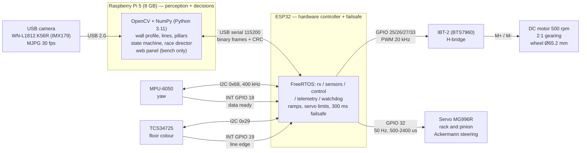

# Electronics — how the car is wired and why

Two controllers, one job each. The Raspberry Pi 5 looks and decides; the ESP32
moves and protects. Everything between them is a serial cable and a binary
frame with a CRC.

- [`pinout.md`](pinout.md) — every pin, taken from the firmware we flash
- [`power-budget.md`](power-budget.md) — rails and current draw
- [`system-block-diagram.svg`](system-block-diagram.svg) — the picture below, printable
- [`wiring-diagram.svg`](wiring-diagram.svg) — connector-level wiring

## System block diagram

## Why it is split this way

**One brain that sees, one that obeys.** The camera work needs an SBC; the motor
needs a hard 10 ms tick. Putting both on the same processor meant the vision
loop stalling the motor loop, and we saw exactly that on the first prototype.
With the ESP32 in the middle the control tick never misses, and — the part that
actually matters in competition — **if the Pi crashes or the USB is yanked, the
ESP32 stops the car by itself after 300 ms.**

**The sensors hang off the ESP32, not off the Pi.** The MPU-6050 and the
TCS34725 are the two sources that must never miss a sample: yaw is integrated,
and a floor line lasts a couple of centimetres at speed. Reading them from the
task that already runs at a fixed tick, and waking that task with the sensors'
own INT pins, gives us the exact `dt` between samples instead of whatever the
scheduler felt like. The code still supports moving them to the Pi's I2C by
changing one word, which is how we tested that the decision was the right one.

**One I2C bus, 400 kHz, and interrupts that never touch it.** The ISRs only
stamp `micros()` and wake the sensor task — calling `Wire` inside an interrupt
is how you hang a bus.

## Safety, in the order things react

1. The navigator brakes on its own when the corridor closes (it sees the wall
   coming, in millimetres, not pixels).
2. The escape manoeuvre backs the car out if it gets stuck.
3. The servo limits are compile-time constants and get applied three times: on
   conversion, on ramping, and on writing to the pin. A servo command out of
   range breaks the steering rack, and we broke one that way.
4. The ESP32 watchdog: if the control task or the Pi goes quiet, the motor stops.
5. The car always boots **disarmed**.
6. The button latches a local cut inside the ESP32: pressed while the car is
   armed, the motor dies on the next 10 ms tick, without waiting for the Pi and
   even if the Pi is hung.

## Rules the wiring has to satisfy

| Rule (WRO 2026 Future Engineers) | How we meet it |
|---|---|
| One driving motor connected to the axle through gearing, one steering actuator | Single DC motor → 2:1 gearing → rear axle; MG996R on the steering rack |
| No differential-drive base | Ackermann steering with a mechanical differential; no independent left/right drive |
| No radio, Bluetooth or Wi-Fi while the vehicle runs | The ESP32 firmware has no Wi-Fi stack at all. The Pi's access point and web panel are bench tools and get shut down before the round |
| One switch to power on, one start button | Main switch on the battery rail; one push button on GPIO 13 that arms and starts, and disarms and stops |
| Wired connections only between components | USB and jumper wires; nothing on the car talks over the air |
